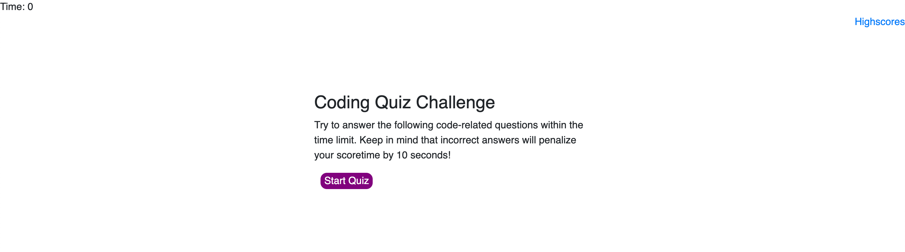

# JavaScript Quiz

This repository holds our fourth homework assignment, a quiz using HTML, CSS, and JavaScript.

## Link to Deployed Application
This application can be found at https://smlisk0630.github.io/homework4/.

## Screenshots

## Credits

- [UNC-Chapel Hill Coding Bootcamp](https://bootcamp.unc.edu/)
- [Gage Eide, tutor](https://github.com/gage117)
- [Sitepoint](https://www.sitepoint.com/simple-javascript-quiz/)
- [Code Boxx](https://code-boxx.com/simple-javascript-quiz/)
